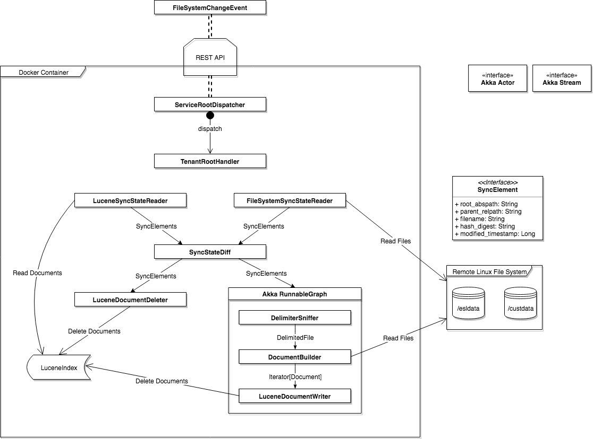

# [Lucene](https://lucene.apache.org/) Indexer for Delimited Files

([Lucene 7.0.1 docs](https://lucene.apache.org/core/7_0_1/index.html))

- index delimited files without predefining schema
    - schema is inferred by splitting header
- full text search across multiple folders, files, and columns
- each column in source data is a [Field](https://lucene.apache.org/core/7_0_1/core/org/apache/lucene/document/Field.html) in Lucene
- each line in source data is a [Document](https://lucene.apache.org/core/7_0_1/core/org/apache/lucene/document/Document.html) in Lucene
- each header in source data is a [Index](https://lucene.apache.org/core/7_0_1/core/org/apache/lucene/index/IndexWriter.html)
- each tenant's Lucene index is persisted in a separate [FSDirectory](https://lucene.apache.org/core/7_0_1/core/org/apache/lucene/store/FSDirectory.html)

## High level logic diagram

## Search results include

- name of matched file
- name (date stamp) of parent folder
- matched column name
- matched line number
- names and values of other columns on matched line

## Overview of Per Tenant Indexing

Each data is organized physically (ie. in `/esldata/`) hierarchially as follows

- Tenant has 1 or more:
    - Dated folder has 1 or more:
        - Delimited data file has 1:
            - Header, delimiter

